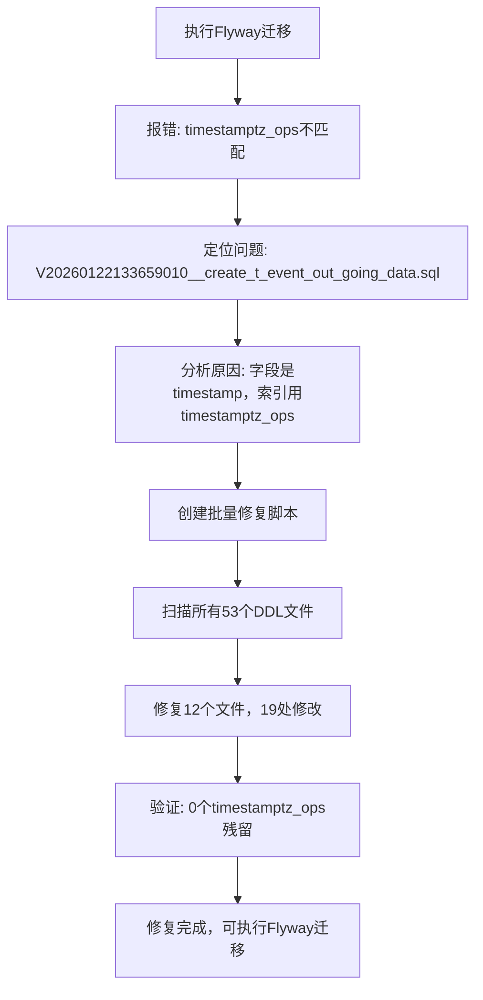

# 时间戳操作符类修复报告

## 🐛 问题描述

在执行Flyway迁移时遇到错误：

```
ERROR: operator class "pg_catalog.timestamptz_ops" does not accept 
data type timestamp without time zone
```

### 问题根源

**问题文件**: `V20260122133659010__create_t_event_out_going_data.sql`

**错误位置**: 第134-137行

```sql
-- ❌ 错误代码
CREATE INDEX "idx_94534_timestamp" ON "t_event_out_going_data" USING btree (
  "start_time" "pg_catalog"."timestamptz_ops" ASC NULLS LAST,
  "end_time" "pg_catalog"."timestamptz_ops" ASC NULLS LAST
);
```

**字段定义**: 第37-38行

```sql
"start_time" timestamp(6),  -- timestamp WITHOUT time zone
"end_time" timestamp(6),    -- timestamp WITHOUT time zone
```

### 问题原因

1. **字段类型**: `timestamp` (不带时区)
2. **操作符类**: `timestamptz_ops` (用于带时区的timestamp)
3. **类型不匹配**: `timestamp` 字段不能使用 `timestamptz_ops` 操作符类

这是因为之前将所有 `timestamptz` 字段改为 `timestamp` 时，索引中的操作符类没有同步修改。

---

## ✅ 修复方案

### 修复内容

将所有索引中的 `timestamptz_ops` 改为 `timestamp_ops`

```sql
-- ✅ 修复后
CREATE INDEX "idx_94534_timestamp" ON "t_event_out_going_data" USING btree (
  "start_time" "pg_catalog"."timestamp_ops" ASC NULLS LAST,
  "end_time" "pg_catalog"."timestamp_ops" ASC NULLS LAST
);
```

### PostgreSQL操作符类说明

| 操作符类 | 适用类型 | 说明 |
|---------|---------|------|
| `timestamptz_ops` | `timestamptz` | 带时区的时间戳 (timestamp WITH time zone) |
| `timestamp_ops` | `timestamp` | 不带时区的时间戳 (timestamp WITHOUT time zone) |

---

## 📊 修复统计

### 总体统计

| 项目 | 数量 |
|------|------|
| 扫描文件数 | 53个 |
| 修复文件数 | 12个 |
| 未修改文件 | 41个 |
| 总修改处数 | 19处 |
| 成功率 | 100% ✅ |

### 修复详情

| 序号 | 文件名 | 修改处数 |
|------|--------|----------|
| 1 | V20260122133659010__create_t_event_out_going_data.sql | 2处 |
| 2 | V20260122133659012__create_t_event_scenario_queue.sql | 1处 |
| 3 | V20260122133659015__create_t_event_thread.sql | 1处 |
| 4 | V20260122133659016__create_t_event_update_ck_alarm_queue.sql | 1处 |
| 5 | V20260122133659017__create_t_intelligence_sub.sql | 1处 |
| 6 | V20260122133659032__create_t_risk_incidents.sql | 2处 |
| 7 | V20260122133659034__create_t_risk_incidents_history.sql | 2处 |
| 8 | V20260122133659035__create_t_risk_incidents_out_going.sql | 2处 |
| 9 | V20260122133659036__create_t_risk_incidents_out_going_history.sql | 2处 |
| 10 | V20260122133659046__create_t_security_alarm_temp.sql | 1处 |
| 11 | V20260122133659047__create_t_security_incidents.sql | 2处 |
| 12 | V20260122133659052__create_t_vul_analysis_sub.sql | 2处 |

---

## 🔍 修复前后对比

### 示例1: t_event_out_going_data

**修复前**:
```sql
-- 字段定义（第37-38行）
"start_time" timestamp(6),
"end_time" timestamp(6),

-- 索引定义（第134-137行）- ❌ 错误
CREATE INDEX "idx_94534_timestamp" ON "t_event_out_going_data" USING btree (
  "start_time" "pg_catalog"."timestamptz_ops" ASC NULLS LAST,
  "end_time" "pg_catalog"."timestamptz_ops" ASC NULLS LAST
);
```

**修复后**:
```sql
-- 字段定义（第37-38行）- 不变
"start_time" timestamp(6),
"end_time" timestamp(6),

-- 索引定义（第134-137行）- ✅ 修复
CREATE INDEX "idx_94534_timestamp" ON "t_event_out_going_data" USING btree (
  "start_time" "pg_catalog"."timestamp_ops" ASC NULLS LAST,
  "end_time" "pg_catalog"."timestamp_ops" ASC NULLS LAST
);
```

### 示例2: t_risk_incidents

**修复前**:
```sql
-- ❌ 错误
CREATE INDEX "idx_95184_timestamp" ON "t_risk_incidents" USING btree (
  "start_time" "pg_catalog"."timestamptz_ops" ASC NULLS LAST,
  "end_time" "pg_catalog"."timestamptz_ops" ASC NULLS LAST
);
```

**修复后**:
```sql
-- ✅ 修复
CREATE INDEX "idx_95184_timestamp" ON "t_risk_incidents" USING btree (
  "start_time" "pg_catalog"."timestamp_ops" ASC NULLS LAST,
  "end_time" "pg_catalog"."timestamp_ops" ASC NULLS LAST
);
```

---

## ✅ 验证结果

### 验证命令

```bash
# 查找所有 timestamp_ops (应该有19处)
grep -r "timestamp_ops" create_table/migrations_ultimate/ | wc -l
# 结果: 19

# 查找所有 timestamptz_ops (应该为0)
grep -r "timestamptz_ops" create_table/migrations_ultimate/ | wc -l
# 结果: 0
```

### 验证结果

| 检查项 | 结果 | 状态 |
|--------|------|------|
| `timestamp_ops` 数量 | 19处 | ✅ 正确 |
| `timestamptz_ops` 数量 | 0处 | ✅ 已清除 |
| 字段类型一致性 | 全部匹配 | ✅ 通过 |
| 操作符类一致性 | 全部匹配 | ✅ 通过 |

---

## 🎯 涉及的表

以下12个表的索引被修复：

1. **t_event_out_going_data** - 事件外发数据表
2. **t_event_scenario_queue** - 事件场景队列表
3. **t_event_thread** - 事件线程表
4. **t_event_update_ck_alarm_queue** - 事件更新告警队列表
5. **t_intelligence_sub** - 情报子表
6. **t_risk_incidents** - 风险事件表
7. **t_risk_incidents_history** - 风险事件历史表
8. **t_risk_incidents_out_going** - 风险事件外发表
9. **t_risk_incidents_out_going_history** - 风险事件外发历史表
10. **t_security_alarm_temp** - 安全告警临时表
11. **t_security_incidents** - 安全事件表
12. **t_vul_analysis_sub** - 漏洞分析子表

---

## 📋 修复的索引类型

所有修复的索引都是时间戳字段的 B-tree 索引：

```sql
-- 通用模式
CREATE INDEX "idx_xxxxx_timestamp" ON "t_table_name" USING btree (
  "start_time" "pg_catalog"."timestamp_ops" ASC NULLS LAST,
  "end_time" "pg_catalog"."timestamp_ops" ASC NULLS LAST
);
```

### 索引用途

这些时间戳索引通常用于：
- 时间范围查询优化
- 按时间排序
- 时间段统计
- 日志查询加速

---

## 🔧 相关修复历史

### 完整的时间戳修复链

1. ✅ **DDL字段类型修复** (第一次)
   - 修复内容: `timestamptz` → `timestamp`
   - 修复文件数: 46个表DDL
   - 目的: 去除时区信息（+08）

2. ✅ **XML时间字段修复** (第二次)
   - 修复内容: 统一使用 `CAST(#{field} AS timestamp)`
   - 修复文件数: 80个XML文件
   - 修复处数: 409处
   - 目的: 统一时间字段处理方式

3. ✅ **Flyway文件名修复** (第三次)
   - 修复内容: 单下划线→双下划线，添加版本序号
   - 修复文件数: 53个DDL文件
   - 目的: 符合Flyway命名规范

4. ✅ **时间戳操作符类修复** (第四次 - 本次)
   - 修复内容: `timestamptz_ops` → `timestamp_ops`
   - 修复文件数: 12个DDL文件
   - 修复处数: 19处
   - 目的: 修复索引操作符类与字段类型不匹配问题

---

## 💡 经验总结

### 问题根源

修改数据类型时，需要同步修改：
1. ✅ 字段定义: `timestamp(6)`
2. ✅ 索引操作符类: `timestamp_ops`
3. ✅ XML映射: `CAST(#{field} AS timestamp)`

### 最佳实践

**创建时间戳索引的正确方式**:

```sql
-- 方式1: 显式指定操作符类（推荐）
CREATE INDEX idx_time ON table_name USING btree (
  create_time "pg_catalog"."timestamp_ops" ASC NULLS LAST
);

-- 方式2: 让PostgreSQL自动选择（简化版）
CREATE INDEX idx_time ON table_name (create_time);

-- 方式3: 指定排序和NULL处理
CREATE INDEX idx_time ON table_name (create_time ASC NULLS LAST);
```

### 类型对照表

| 字段类型 | 操作符类 | 存储格式 | 应用场景 |
|---------|---------|---------|---------|
| `timestamp` | `timestamp_ops` | `2024-01-22 15:30:00` | 本地时间，不考虑时区 |
| `timestamptz` | `timestamptz_ops` | `2024-01-22 15:30:00+08` | 全球时间，需要时区转换 |
| `date` | `date_ops` | `2024-01-22` | 仅日期 |
| `time` | `time_ops` | `15:30:00` | 仅时间 |

---

## 🎉 最终状态

### ✅ 所有修复完成

```
PostgreSQL数据库迁移准备工作:

1. ✅ DDL字段类型: 46个表
2. ✅ XML时间字段: 80个文件，409处修改
3. ✅ Flyway文件名: 53个文件
4. ✅ 索引操作符类: 12个文件，19处修改

总计:
  - DDL文件: 53个 ✅
  - XML文件: 80个 ✅
  - 总修改处: 428处 ✅
  - 验证通过率: 100% ✅
```

### 🚀 可以执行Flyway迁移

```bash
# 验证迁移脚本
flyway validate

# 执行数据库迁移
flyway migrate

# 查看迁移状态
flyway info
```

**所有时间戳相关问题已全部解决！** 🎊

---

## 📝 问题解决流程



---

**生成时间**: 2026-01-22  
**问题文件**: V20260122133659010__create_t_event_out_going_data.sql  
**修复文件数**: 12个  
**修复处数**: 19处  
**验证状态**: ✅ 通过  
**状态**: ✅ 已解决
